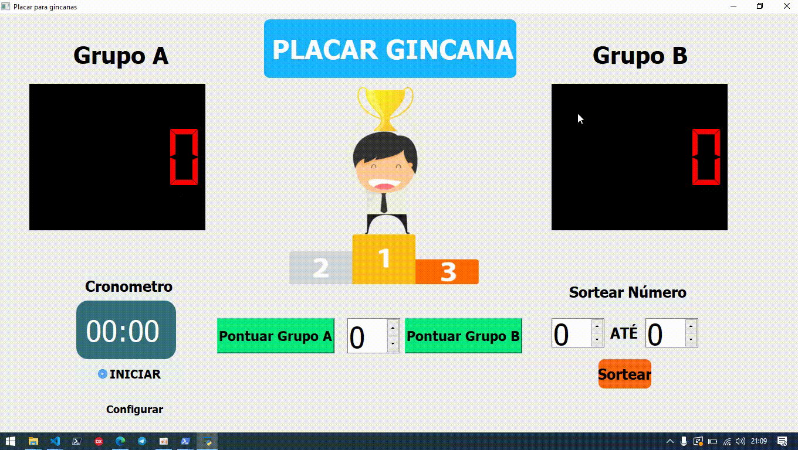

# Placar para Gincanas
Aplicação desenvolvida utilizando a framework Pyqt5.
Pyqt5 foi a primeira GUI que aprendi. Sinta-se a vontade para estudar e modificar este simples projeto

Demo:

## Instalação
abra o powershell/terminal e execute:

`pip install PyQt5`

na pasta do projeto:

`python main.py`

### Disclaimer:
Este simples projeto deu-se quando estava aprendendo os diversos contextos da programação. Portanto, deve ter bastade *badsmeels*.
